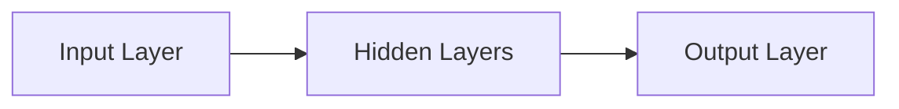
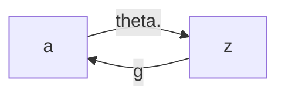

## What is Machine Learning?
E = the experience of playing many games of checkers

T = the task of playing checkers.

P = the probability that the program will win the next game.


## Supervised Learning
"right answer" given

## Unsupervised Learning
机器自己找cluster，组成type，没有一个固定的答案。

## Cocktail Party Problem
两个人说不一样的话，两个麦克风分别录，会录出两个人的声音的combination，而Unsupervised Learning的指责就是把二者分开

$n$---number of features\
$m$---number of training examples\
$x_j^i$---value of feature j in the $i^{th}$ training example\
$y$---output\
$(x,y)$---one training example \
$(x^i, y^i)---\text{the }i^{th}\text{ training example}$\
$h$---hypothesis，就是一个function，例如h(x)=ax+b

## Square Error Cost Function 
$J(\theta_1, \theta_0) = \frac{1}{2m} \sum_{i=1}^{m} (h(x^i)-y^i)$
找到两个theta的值，使得cost function最小，就得到了best-fit line. 

## Contour Figure 等高线
这时，横纵轴由$\theta_1和\theta_2$组成，而我们要找的最优则在所有圆的中心（那个小圈圈的圆心附近）
其实吧，这个等高线就是把之前那个bowl图给二维化了

## Gradient Descent梯度下降
1. Start with soem $\theta_0$ and $\theta_1$ 比如都等于1
2. Keep changing $\theta_0$ and $\theta_1$ to reduce $J(\theta_0,\theta_1)$ until ending up at a minimum 

数学上来说：
repeat until convergence {
    $\theta_j := \theta_j -\alpha \dfrac{\partial}{\partial\theta_j} J(\theta_0, \theta_1) (\text{for }j=0\text{ and }j=1$
}
// :=是assignment，即赋值的意思
//$alpha$是learning rate，设置的太小会很慢找到正确值，太大直接冲出去飞了。再者，alpha不动也是可以找到minimum的，因为derivative component在慢慢变小
//$\dfrac{\partial}{\partial\theta_j} J(\theta_0, \theta_1)$则是derivative component

注意一个叫做simultaneously update，也就是说每次在右边算完一个$\theta$不要立刻assign，等下一个$\theta$算完了再一起update

它还有一个事儿，就是容易converge to a local minimum 

## 将cost function和Gradient Descent结合一下：
$\theta_0: j=0 \to \dfrac{\partial}{\partial\theta_j} J(\theta_0, \theta_1) \to \dfrac1m \sum_{i=1}^{m} (h(x^i)-y^i)$\
$\theta_1: j=1 \to \dfrac{\partial}{\partial\theta_j} J(\theta_0, \theta_1) \to \dfrac1m \sum_{i=1}^{m} (h(x^i)-y^i) \cdot x^i$

repeat until convergence {\
    $\theta_0 := \theta_0 -\alpha \frac1m \sum_{i=1}^{m} (h(x^i)-y^i)$\
    $\theta_1 := \theta_1 -\alpha \frac1m \sum_{i=1}^{m} (h(x^i)-y^i) \cdot x^i$\
}
两者结合起来就变成了convex function，也是bowl shape的，也就是说它只有一个minimum

## “Batch” Gradient Descent
each step of gradient descent uses all the training examples. 


## Multiple Features
$n$---number of features\
$x_j^i$---value of feature j in the $i^{th}$ training example\

For convenience of notation, define $x_0=1$，则$h_\theta(x) = \theta_0x_0 + \theta_1x_1 + \theta_2x_2 + ...$，可以写作transpose，得到：\
$\text{multivariate linear regression : }h_\theta(x) = \theta^Tx$

repeat until convergence {\
    $\theta_j := \theta_j -\alpha \frac1m \sum_{i=1}^{m} (h(x^i)-y^i) \cdot x^j$\
}

## Featuring Scaling
#### Make sure features are on a similiar scale
因为如果太细长了，就会左右横跳，沿着椭圆的长轴很慢地找到中心点。理想状况下，这应该接近正圆

#### Get every feature into approximately a $-1≤x_i≤1$ range
±3都是可以接受的

## Mean Normalization
#### Replace $x_i$ with $\dfrac{x_i-\mu_i}{s}$to make features have approximately zero mean
这里的s可以是standard deviation，也可以是range（max-min）

## Debugging gradient descent
 $J(\theta)$ should decrease after every iteration. 

## Automatic Convergence Test:
举个栗子：Declare convergence if $J(\theta)$ decreases by less than $10^{-3}$ in one iteration. 其实这个方法不好用，原因是这个数字设计不好。不如直接看plot来得准确\
这里的plot指的是Y轴=$J(\theta)$， X轴=number of iteration。然后这个图应该是反比例函数的形状才是正确的。

#### Choose sufficiently small $\alpha$, $J(\theta)$ should decrease by every iteration. 
To choose $\alpha$, try `0.001, 0.003, 0.01, 0.03, 0.1, 0.3, 1, ...`

## Polynomial Regression 
可以人为的change the behavior or curve，比如
#### Quadratic Function
$h_{\theta}(x)=\theta_0+\theta_1x_1  \to h_{\theta}(x)=\theta_0+\theta_1x_1+\theta_2x_1^2$ by creating $x_2=x_1^2$
#### Cubic Function 
$h_{\theta}(x)=\theta_0+\theta_1x_1  \to h_{\theta}(x)=\theta_0+\theta_1x_1+\theta_2x_1^2+\theta_3x^3_1$
by creating $x_2=x_1^2$, $x_3=x_1^3$
#### Square Root Function
$h_{\theta}(x)=\theta_0+\theta_1x_1  \to h_{\theta}(x)=\theta_0+\theta_1x_1+\theta_2\sqrt{x_1}$ by creating $x_2=\sqrt{x_1}$

## Normal Equation 
目的是为了minimize the cost function J
1. 把X变成matrix，行是"specific hosue"，纵是某一个feature（比如size或者num of bedroom）(其中$x_0=1$)
2. 把y变成一个vector
3. $\theta=(X^TX)^{-1}X^Ty$ Octave：`pinv(transpose(X)*X)*transpose(X)*y`
注意，Normal Equation是不需要 Feature Scaling的，但是Gradient Descent还是需要它


| Gradient Descent                                  | Normal Equation                        |
| ------------------------------------------------- | -------------------------------------- |
| Need to choose $\alpha$                           | No choose $\alpha$                     |
| Need many iteration                               | No iteration                           |
| Works well even large n                           | Slow if large n                        |
| $O(kn^2)$                                         | $O(n^3)$ need to compute $(X^TX)^{-1}$ |
| More useful for various algorithm (like logistic) | Fail logistic                          |
($10^4$才算大，$10^6$肯定就直接Gradient Descent了)


##### 那万一$X^TX$ not invertible咋办（比如singular / degenerate）？
首先呢，这种情况很少发生。
选择pinv()吧，它能算non-invertible，而inv()却做不到

两种情况会导致non-invertible
1. Redundant feature(linearly dependent)，比如长度用米表示过了，再用inch表示一遍，他俩就dependent
2. Too many features(e.g. m≤n)比如五个sample，但是100个feature。解决方法是delete some feature or "regularization"(之后会学)


## Classification
$y\in\{0,1\}$ 0 is "Negative Class", 1 is "Positive Class" (我们目前先focus on binary classification problem，以后学多元的)

很多时候linear regression都不适合这种classification problem，否则会出现y值($h_\theta(x)$)大于1或者小于0的情况（注意正常来说应该只有1和0的）

### Hypothesis Representation


### Logistic Regression
Logistic function / Sigmoid function: 
$g(z)=\dfrac{1}{1+e^{-z}}$

Logistic Regression Model: $h_\theta(x)=g(\theta^Tx)=\dfrac{1}{1+e^{-\theta^Tx}}$

Interpretation of Hypothesis Output: 
$h_\theta(x)=P(y=1|x;\theta)$ 读作 probability that y=1, given x, parameterized by $\theta$ 即estimated probability that y=1 on input x

### Decision Boundary

定义：The **decision boundary** is the line that separates the area where y = 0 and where y = 1. It is created by our hypothesis function.

归类遵循这个原理
$$
\begin{cases}
y=1 &\text{  if  } h_\theta(x)≥0.5\\
y=0 &\text{  if  } h_\theta(x)<0.5\\
\end{cases}
$$
又已知，对于logistic而言
$$
h_\theta(x)=
\begin{cases}
g(\theta^Tx)≥0.5 &\text{  if  } \theta^Tx≥0\\
g(\theta^Tx)<0.5 &\text{  if  } \theta^Tx<0\\
\end{cases}
$$
那么对于logistic来说，已知
$$
\begin{cases}
g(z)≥0.5 &\text{  if  } z≥0\\
g(z)<0.5 &\text{  if  } z<0\\
\end{cases}
$$
可得
$$
\begin{cases}
y=1 &\text{  if  } \theta^Tx≥0\\
y=0 &\text{  if  } \theta^Tx<0\\
\end{cases}
$$

### 利用cost function来fit我们的logistic function 
$$
Cost(h_\theta(x),y)=
\begin{cases}
-log(h_\theta(x) &\text{  if  } y=1\\
-log(1-h_\theta(x) &\text{  if  } y=0\\
\end{cases}
$$
简而言之，cost function就是我们给algorithm的penalty，如果计算机错的很离谱，就给很大的惩罚（cost function较大），如果接近正确值就小惩罚。

这个logistic function的cost function简而言之就是，当$h_\theta(x)=y$是最好的，差的越远，cost（惩罚）越大

然后这个cost可以compress一下：
$$Cost(h_\theta(x),y)=-y*log(h_\theta(x))-(1-y)*log(1-h_\theta(x))
$$
为啥呢，因为y要么1要么0，那么y和1-y中一定有一个是0，于是乎就可以去掉其中一个term

接下来，可以写出cost funcion 的完全体：
$$
J(\theta) = \dfrac1m\sum_{i=1}^m Cost(h_\theta(x),y) = \dfrac1m\sum_{i=1}^m [-y*log(h_\theta(x))-(1-y)*log(1-h_\theta(x))]
$$
然后还能vecterize implement一下，也就是把序号0~n的xy都做成一个vector，然后运算vector，消除掉难搞的$\sum$
$$
h=g(X\theta) \text{不明白这里是怎么做到的，难道是}h_\theta(x)=g(\theta^Tx)？\\
J(\theta) = \dfrac1m (-y^T*log(h)-(1-y)^T*log(1-h))
$$
Then, Try to find the $\theta$ minimize $J(\theta)$
有了$\theta$，再来make a prediction given new x: $h_\theta(x) = \dfrac1{1+e^{-\theta^Tx}}$

这个核心就是如何minimize funcion theta呢？答案就是**Gradient Descent**
公式和linear regression的一毛一样，唯一区别就是在于$h_\theta(x)$变化了
$$
\theta := \theta -\dfrac\alpha m X^T(g(X\theta))-\vec y)
$$
### Advanced Optimization 
Gradient Descent只是optimize/minimize cost funcion的一种方法，还有很多，比如
- Conjugate gradient
- BFGS
- L-BFGS
它仨有好有坏：

| Advantage                         | Disadvantage |
| --------------------------------- | ------------ |
| No need to manually pick $\alpha$ | More complex |
| faster than gradient descent      |

这些东西innner logic极其复杂，所以用library让电脑自己搞就好了

## Multiclass Classification Problem

### One-vs-All (one-vs-rest)
将多个class转换成两个group，于是乎只剩两组：“这一个”和“其他”，经过训练出现了针对一号class的classifier1（$\theta=1$），针对二号class的classifier2（$\theta=2$），针对三号class的classifier3（$\theta=3$）接下来, $h_\theta^{(i)}(x) = P(y=i|x;\theta) (i=1,2,3)$. To make a prediction on a new x, pick the class that maximize $h_\theta(x)$

## Overfit

- underfit / high bias 特别不精确
- just right
- overfit / high variance 只能特别好地fit已有的sample，无法predict。定义：If we have too many features, the learned hypothesis may fit the training set very well, but fail to generalize to new examples. 

### Addressing overfitting
plot可以帮助visualization，但是feature太多就不好说了

一般两种方法:
1. Reduce number of features
    - Manually select which features to keep
    - Model selection algerithm (later)
2. Regularization
    - Keep all the features, but reduce magnitude/value of parameters $\theta_j$
    - Regularization works well when we have a lot of slightly useful features. 


### Regularization 
就是让$\theta$变小，权重变小则这个feature就不重要了。

Small values for parameters $\theta$:
- "Simpler" hypothesis
- Less prone to overfitting. 

那么如何做到呢？如何让$\theta$变小呢？其实是在cost function屁股后面加一个regularization term:
$$
J(\theta) = \dfrac1{2m}[\sum^m_{i=1}(h_\theta(x^i)-y^i)^2 + \lambda\sum^n_{j=1}\theta_j^2]
$$
这里的$\lambda$就是regularization parameter，它负责control trade off of fitting and keeping theta small. 

#### 对于Gradient Descent的Regularization
Repeat {
$$
\begin{aligned}
\theta_0 & := \theta_0-\alpha\dfrac1m \sum_{i=1}^m (h_\theta(x^i)-y^i)x_0^i\\
\theta_j & := \theta_j-\alpha[(\dfrac1m \sum_{i=1}^m (h_\theta(x^i)-y^i)x_j^i) + \dfrac\lambda m \theta_j]\quad\quad j\in\{1,2,...,n\}\\
& := \theta_j(1-\alpha\dfrac\lambda m)-\alpha\dfrac1m \sum_{i=1}^m (h_\theta(x^i)-y^i)x_j^i\quad\quad j\in\{1,2,...,n\}\\
\end{aligned}
$$
}

这里有两个点值得注意
1. $\theta_0$和其他$\theta$是分开写的，因为$\theta_0$不需要regularize
2. $(1-\alpha\dfrac\lambda m) < 1$，正因如此，它作为$\theta_j$的系数才能使它越来越小

#### 对于Normal Equation的Regularization
$$
\begin{aligned}
\theta &= (X^TX+\lambda \cdot L)^{-1}X^Ty\\
\text{where }L &= 
\begin{bmatrix}
   0 & 0 & 0 & 0 & 0 & . & 0\\
   0 & 1 & 0 & 0 & 0 & . & 0\\
   0 & 0 & 1 & 0 & 0 & . & 0\\
   0 & 0 & 0 & 1 & 0 & . & 0\\
   0 & 0 & 0 & 0 & 1 & . & 0\\
   . & . & . & . & . & . & 0\\
   0 & 0 & 0 & 0 & 0 & 0 & 1\\
\end{bmatrix}
\end{aligned}
$$

同样的，需要注意的点：
1. 成功解决了m < n时，$(...)^{-1}$ 不invertible的问题
2. L的dimension为$(n-1)*(n-1)$，不是真正的Identical matrix，主要是为了照顾$x_0$，和Gradient Descent的1是同样的道理


### Regularized Logistic Regression
#### Cost Function
$$
J(\theta) = -\dfrac1{m}\sum^m_{i=1}[y^ilog(h_\theta(x^i))+(1-y^i)log(1-h_\theta(x^i))] + \dfrac\lambda{2m}\sum^n_{j=1}\theta_j^2]
$$


# Neural Network

##### Non-linear Classification 
针对multi-feature设计，毕竟之前的polynomial也只能解决binary classification. 解释：如果每个polynomial单项式有2个feature，那么n个feature就对应$n^2$个单项式，如果每个polynomial单项式有3个feature，那么n个feature就对应$n^3$个单项式，这很可怕。那什么时候feature巨多呢？图片！每个pixel都是一个feature，那个学习量可想而知，啧啧啧。

##### Neural Network
Origin: mimic the brain 



If network has $s_j$ units in layer j, $s_{j+1}$ units in layer $j+1$, then $\theta^j$ will be of dimension $s_{j+1}*(s_j+1)$\
解释：$s_{j+1}$很好理解，下一个layer有几个unit（几个圆圈），那就是几行。$(s_j+1)$则是这一个layer有几个unit，再加上bias unit $a_0$，得到下一个layer的$\theta$有几列

Define $z^j=\theta^{j-1}*a^{j-1}$ 
则，$a^j=g(z^j)$
$z^{j+1} = \theta^j*a^j$



### Cost Function
我们先来定义：
$$
\begin{aligned}
&h_\theta(x)\in\reals^k \\
&(h_\theta(x))_i = i^{th}\text{ output}
\end{aligned}
$$
那么得出式子:
$$
\begin{aligned}
J(\theta) &= -\dfrac1m[\sum_{i=1}^m\sum_{k=1}^K~y_k^i~log(h_\theta(x^i))_k~+~(1-y_k^i)~log(1-h_\theta(x^i)_k)]\\~&+~\dfrac\lambda{2m}\sum_{l=1}^{L-1}\sum_{i=1}^{s_l}\sum_{i=1}^{s_l+1}(\theta_{ji}^l)^2
\end{aligned}
$$
###### Notes:
- the double sum simply adds up the logistic regression costs calculated for each cell in the output layer
- the triple sum simply adds up the squares of all the individual Θs in the entire network.
- the i in the triple sum does not refer to training example i
#### Binary Classification
one output unit (即$k=1$，也可以写作$s_L=1$)
#### Multi-class Classification (K classes)
K output unit (即$k≥3$，也可以写作$s_L≥3$)

### Propagation
#### Forward Propagation
也就是一个套娃的过程
$$
\begin{aligned}
a^1&=x\\
z^2&=\theta^1a^1\\
a^2&=g(z^2)\quad(add a_0^2)\\
z^3&=\theta^2a^2\\
a^3&=g(z^3)\quad(add a_0^3)\\
z^4&=\theta^3a^3\\
a^4&=h_\theta(x)=g(z^4)\\
\end{aligned}
$$
这里的$a,z,\theta$都是vector，每一个vector都是一个layer，而里面每一个element都是一个unit

#### Backpropagation Algorithm
用来算derivative
**Define:**$\delta_j^l=\text{"error" of node j in layer l}$
$$
\begin{aligned}
\delta^4&=a^4-y\quad(解释一下这里的y，类比于初始值x，它是末值y)\\
\delta^3&=(\theta^3)^T\delta^4 \cdot g'(z^3)\\
\delta^2&=(\theta^2)^T\delta^3 \cdot g'(z^2)\\
\end{aligned}
$$
虽然不懂，但是还是记一手：$g'(z^i)=a^i\cdot(1-a^i)$

然后这一套骚操作下来就可以得到$\dfrac\partial{\partial\theta_{ij}^l}J(\theta) = a_j^l \delta_i^{l+1} \text{ if } \lambda=0$，如果vectorized一下就变成了$\delta^l=(a^l)^T\delta^{l+1}$

老师还说$\delta^2_2 = \theta^2_{1,2}\delta^3_1 ~+~ \theta^2_{2,2}\delta^3_2$


# Unsupervised Learning 
特点是只有x没有y
比如cluster就是一种典型的unsupervised learning
最终目的是为了找到数据的structure

## K-mean Algorithm
1. 随便定下K个initialize cluster centroids，K=number of clusters这里为了举例就说有两个点$\mu_1$和$\mu_2$吧
2. 离$\mu_1$点近的数据放在$\mu_1$组，离$\mu_2$近去$\mu_2$组
3. 分别计算$\mu_1 \mu_2$的mean，标作$\mu_3$和$\mu_4$吧
4. 现在$\mu_3$和$\mu_4$分别是两个新的cluster centroids了，再来一遍吧

好，现在来正式写一下过程吧：


randomly initialize K cluster ecntroids $\mu_1, \mu_2, ..., \mu_K \in \reals^n$
Repeat{
&nbsp;&nbsp;&nbsp;&nbsp;for $i=1$ to $m$ (cluster assignment step)
&nbsp;&nbsp;&nbsp;&nbsp;&nbsp;&nbsp;&nbsp;&nbsp;$c^i$:=$i$ of cluster centroid closest to $x^i$. $c^2=3$就是二号sample被分进了第三组，因为在第三组内它距离三号mean的距离最短
&nbsp;&nbsp;&nbsp;&nbsp;for $k=1$ to $K$ (Move centroid)
&nbsp;&nbsp;&nbsp;&nbsp;&nbsp;&nbsp;&nbsp;&nbsp;$\mu_k$:=average of points assigned to cluster $k$
}

如果某个cluster centroid没有一个sample加入它，那么直接eliminate就好

input: 
- $K$ (number of clusters = number of points )
- Training set $\{x^1, x^2,...,x^m\}$

## K-mean optimization objective
就像cost function一样，K-mean也有自己的object。这个$J(c^i,...,c^m; \mu_1,...,\mu_K)$有个名字：distortion cost function，或者叫做the distortion of the k-means algorithm
$$
J(c^i,...,c^m; \mu_1,...,\mu_K) = \dfrac1m\sum_{i=1}m||x^i-\mu_{c^i}||^2
$$

### K-means optimization algorithm

Randomly initialize K cluster centroids $\mu_1,\mu_2,...,\mu_K \in \reals^n$
Repeat{
&nbsp;&nbsp;&nbsp;&nbsp;for $i=1$ to $m$ (minimize $J()$ with $c^i$ while holding $\mu_k$ fixed)
&nbsp;&nbsp;&nbsp;&nbsp;&nbsp;&nbsp;&nbsp;&nbsp;$c^i$ := index (from 1 to K) of cluster centroid closest to $x^i$
&nbsp;&nbsp;&nbsp;&nbsp;for $k=1$ to $K$ (minimize $J()$ with $\mu_k$ while holding $c^i$ fixed)
&nbsp;&nbsp;&nbsp;&nbsp;&nbsp;&nbsp;&nbsp;&nbsp;$\mu_k$ := average of points assigned to cluster $k$
}

## How to random initialize K?
1. Should have $K<m$
2. Randomly pick $K$ training examples 
3. Set $\mu_1,...,\mu_K$ equal to these $K$ examples
也就是说pick ran K的时候没必要真的实诚地random，而是从每个cluster中挑出某个点，作为起始cluster centroid，写成数学长这样：$\mu_1 = x^i, \mu_2 = x^j$

但有时候K的选择导致stuck on the local optima，如何避免这种情况呢？多random几次就好啦！

For i = 1 to (50 ~ 1000){
&nbsp;&nbsp;&nbsp;&nbsp; Randomly initialize K-means.
&nbsp;&nbsp;&nbsp;&nbsp; Run K-means. Get $c^i,...,c^m; \mu_1,...,\mu_K$
&nbsp;&nbsp;&nbsp;&nbsp; Compute cost function (distortion) $J(c^i,...,c^m; \mu_1,...,\mu_K)$
}
Pick clustering that gave lowest cost $J(c^i,...,c^m; \mu_1,...,\mu_K)$

## Choose how many clusters?
目前其实大家都是手动设置分几组的，先visualization，然后肉眼一看，再手动设置。但还是有点门道的，比如
#### Elbow method:
1. Plot J (cost function) versus K (no. of clusters)
2. 找到一个折点，在这里斜率急剧变化，本来J下降的很快的，突然慢下来了，那么就是这个点


---------------------------------------------------------
# 一些general但是很重要的概念

| Notation                                 | Explanation                                                                                                                                                                                                                                                               |
| ---------------------------------------- | ------------------------------------------------------------------------------------------------------------------------------------------------------------------------------------------------------------------------------------------------------------------------- |
| $\theta_3$                               | weight 可以理解为3号feature的权重。比如风水可能影响房价，但是影响很小，所以权重低                                                                                                                                                                                         |
| $J(\theta)$                              | Cost function  $J(\theta) = -\dfrac1m[\sum_{i=1}^m Cost(i)]$                                                                                                                                                                                                              |
| $x_j^i$                                  | value of feature $j$ in the $i^{th}$ training example                                                                                                                                                                                                                     |
| $g(z)$                                   | activation function，比如对于Logistic function $g(z)=\dfrac{1}{1+e^{-z}}$                                                                                                                                                                                                 |
| $h_\theta(x)$                            | 它是一个Regression Model（$h_\theta(x)=g(\theta^Tx)$）用来estimate hypothesis output，即$h_\theta(x)=P(y=1\|x;\theta)$,比如对于logistic:  $h_\theta(x)=\dfrac{1}{1+e^{-\theta^Tx}}$，对于linear:$h_\theta(x) = \theta_0x_0 + \theta_1x_1 + \theta_2x_2 + ... = \theta^Tx$ |
| $x_0$                                    | bias unit                                                                                                                                                                                                                                                                 |
| $a_i^j$                                  | "activation" of unit i in layer j, 本质上z和a是一个东西，简单点说z是上一个a套上了theta，再给这个z套上g()就成了新的这个a，即Define $z^j=\theta^{j-1}*a^{j-1}$则$a^j=g(z^j)$并且$z^{j+1} = \theta^j*a^j$                                                                    |
| $\theta^{layer}_{next~ unit,~this~unit}$ | matrix of weights controlling function mapping from this layer to the next layer                                                                                                                                                                                          |
| $L$                                      | Total number of layers in netwrok                                                                                                                                                                                                                                         |
| $s_l$                                    | number of units (not counting bias unit)in layer $l$, $s_1=3$指的是第一个layer有3个unit，并且layer都是从1算起，而非0                                                                                                                                                      |
| $\delta_j^l$                             | "error" of node j in layer l}                                                                                                                                                                                                                                             |
| $c^i$                                    | index of cluster (1,2,...,K) to which example $x^i$ is currently assigned                                                                                                                                                                                                 |
| $\mu_k$                                  | cluster centroid $k$ ($\mu_k \in \reals^n$)                                                                                                                                                                                                                               |
| $\mu_{c^i}$                              | cluster centroid of cluster to which example $x^i$ has been assigned                                                                                                                                                                                                      |


### 建模步骤：
1. 拿到一组由x,y组成的数据]
2. 引用Regression function,取决于用什么Algorithm
3. 计算cost function  $J(\theta)$
4. 计算partial derivative  $\dfrac{\partial}{\partial\theta}J(\theta)$
5. find theta that minimize J
6. theta带回原regression得到一个好的model
```

