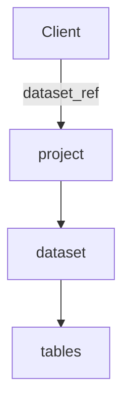

# 1. Get start

## Import the data



```
from google.cloud import bigquery

# Create a "Client" object
client = bigquery.Client()

# Construct a reference to the "chicago_crime" dataset
dataset_ref = client.dataset("chicago_crime", project="bigquery-public-data")

# API request - fetch the dataset
dataset = client.get_dataset(dataset_ref)
```

## Get `table_id`
```
tables = list(client.list_tables(dataset))

for table in tables:
    print(table.table_id)
```

## Display table
第一步，先把装data的盒子打开
```
# Construct a reference to the "table_id" table
table_ref = dataset_ref.table("table_id")

# API request - fetch the table
table = client.get_table(table_ref)
```

然后可以print所有的data，像这样（其实不常用，因为不好读，一般下面那个好一点）
```
table.schema
```
或者只看几行就可以了
```
# API request - run the query, and convert the results to a pandas DataFrame

client.list_rows(table, max_results = 5).to_dataframe()
```
也可以只看某列
```
client.list_rows(table, selected_fields = table.schema[:1], max_results = 5).to_dataframe()
```

## Display query
既然把import的table给筛选完放进query了，那怎么显示这个query呢？
```
rides_per_year_query = """
                       SELECT ...
                       FROM `...`
                       GROUP BY ...
                       ORDER BY ...
                       """

# Set up the query 
safe_config = bigquery.QueryJobConfig(maximum_bytes_billed=10**10)
rides_per_year_query_job = client.query(rides_per_year_query, job_config=safe_config)

# API request - run the query, and return a pandas DataFrame
rides_per_year_result = rides_per_year_query_job.to_dataframe()

# View results
print(rides_per_year_result)
```

# 2. select raw data with conditions
## `SELECT`
这一列的名字，比如“名字”。它决定你最后output出来是啥，每select一项，output的table就会多出它的一列
## `FROM `` `
源文件：从哪个file/table里面选出来？（注意符号是backtick `)
```
FROM `project_name.dataset_name.table_name`
```
## `WHERE a = ' '`
这里是一个condition，和if一样的，比如 性别="男"
注意这里只有一个`=`，而不是`==`

## `WHERE ... LIKE '...'`
`''`中的东西可以用`%`代替，比如`2019%`就是`2019`开头的所有项


## 举个栗子：
```
# Query to select all the items from the "city" column where the "country" column is 'US'
query = """
        SELECT city
        FROM `bigquery-public-data.openaq.global_air_quality`
        WHERE country = 'US'
        """
```

# 3. Group & Count
## `COUNT()`
给出这一列的名字，得到这一列有几行，也就是这一列多少element
`COUNT()`属于**aggregate function**，也就是说它和 `SUM(), AVG(), MIN(), MAX()`是一样的。

## `GROUP BY `
配合`COUNT()`使用的。大概就是根据条件进行count，比如
```
query = """
    SELECT Animal, COUNT(1)
    FROM `bigquery-public-data.pet_records.pets`
    GROUP BY Animal
```
这时候 “只数” 就会根据不同的animal输出来，比如dog=2, cat=3, rabbit=1

## `GROUP BY ... HAVING`
又是一个搭配`GROUP BY`使用的东西，就是加一个条件而已，话不多说，上例子
```
query = """
    SELECT Animal, COUNT(ID)
    FROM `bigquery-public-data.pet_records.pets`
    GROUP BY Animal
    HAVING COUNT(ID) > 1
```

```
query = """
    SELECT parent, COUNT(id)
    FROM `table_ref`
    GROUP BY parent
    HAVING COUNT(id)>10
"""
```

# 4. Order
## `Order By`
默认从小到大升序排序，按ASCII的顺序
```
query = """
        SELECT id, name, animal, age
        FROM `...`
        ORDER BY age
```
### `DESC`
也可以从大到小降序排序
```
query = """
        SELECT id, name, animal, age
        FROM `...`
        ORDER BY age DESC
        """
```

## `EXTRACT`

### Date
`YYYY-[M]M-[D]D`
- `YYYY`: Four-digit year
- `[M]M`: One or two digit month
- `[D]D`: One or two digit day

那么如果我们不想看整个date，而是只有month或者week呢？ （没错，week它也能自动算）

```
query = """
        SELECT id, EXTRACT(WEEK from DATE) AS week
        FROM `...`
        """
```
这样就有两列，一列id，一列week


# 5. As & With

## `AS`
默认output的column name是`f0__`，如果你想改呢？那就`COUNT(...) AS variableName`，这样`f0__`就变成了`variableName`

## `WITH ... AS `
它是一种CTE，在这里可以起到一种“提前筛选”的作用
``` 
query = """
        WITH Seniors AS
        (
            SELECT ID, Name
            FROM `...`
            WHERE Years_old > 5
        )
        SELECT ID
        FROM Seniors
        """
```

### common table expression (CTE)
A common table expression (or CTE) is a temporary table that you return within your query. CTEs are helpful for splitting your queries into readable chunks, and you can write queries against them.
注意CTE是个local variable一样的东西，它仅存在于这个query中，query结束就消失了。所以我们在query中创造了这个CTE马上就要用。

# 6. Joining Data
combine data sources.

## `INNER JOIN ... ON`
有两个表格，根据他们的交集将二者并起来，比如一场final exam，有phy的总成绩和eco的总成绩，要根据学生的id将两个成绩做到一张表格里去
```
query = """
        SELECT phy.score AS phy_score, eco.score AS eco_score
        FROM `final_exam.all_phy_score` AS phy
        INNER JOIN `final_exam.all_eco_score` AS eco
            ON phy.student_id = eco.student_id
```

